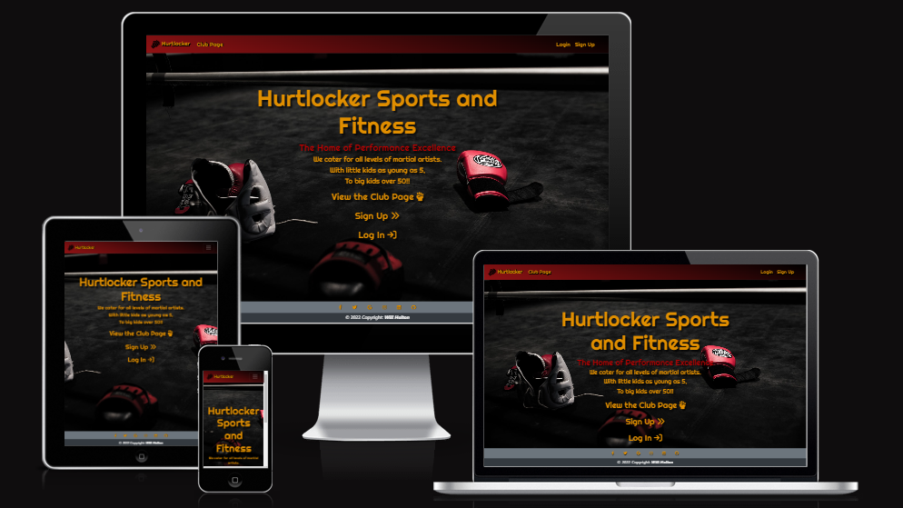
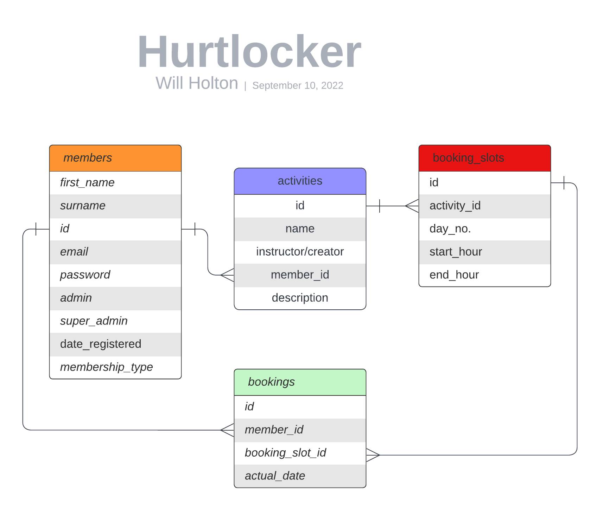

# **Hurtlocker**

## *Full Stack Frameworks With Django Milestone Project*



<hr>

## **Goal for this project** 

Welcome to Hurtlocker Sports Club.

The goal of this project is to create a web application for a sports club so that they can recruit new members and securely, and easily accept subscriptions from members. The app will provide members with information regarding the club and its activities. Users will be able to browse the different activity types and make bookings when they have purchased a membership subscription. When they purchase a subscription they will receive a list of the upcoming events associated with their membership and in turn will be able to make bookings and attend the sessions.

The app was deployed using Heroku and can be found here: [Hurtlocker](https://hurtlocker-jtb.herokuapp.com/)

<hr>

## **UX**

### **Site Objectives**

#### **Hurtlocker assists club owners by:**

1. Providing a platform to publicise the club and in turn assists with recruiting new members and collecting subscriptions from them.
2. Serving as a place where the club can display basic info about the club, its activities and schedules.
3. EThe app will also allow staff members of the club schedule sessions and make them available for booking.


#### **Hurtlocker assists users and members by:**

1. Providing a platform for them to see what activities are available and what benefits subscribing would have.
2. Enabling users to sign up and easily pay for their subscriptions.
3. Presenting useful information to members regarding the club, its activities and schedule.
4. Allows paid members to book activities through the site and in turn attend the sessions.

### **User Stories**

**As a user:**

I want to be able to create an account
I want to view the various activities the club caters for and what a membership allows me to do.  
I want to sign up for membership and pay for it securely.  
I want to see more in depth information regarding the clubs activities and schedule.
I want to book activities.  
I want to view my upcoming bookings for activities and cancel if needs be.  
I want to create a profile for my user and customize it accordingly.  
I want to cancel my subscription if I need to.   
I want to view my subscription end date/renewal.

**As an admin:**

I want to see subscribers to the club and when they are subscribed until  
I want to update the activity information and add,edit and delete new activities and update their schedules.  
I want to see which members have booked which activities.  

### **Design Choices**

I spent a lot of time initially thinking about the design of the website for Hurtlocker.  
I went for darker colors of black and dark red along with a slightly mustard yellow to make things stand out a bit.  
The theme fits that of a martial arts gym.  

#### **Fonts** 
I used Google Fonts to explore the various options available and went for some basic clean fonts.  
For the titles and subtitles, I went with the font Righteous and for the main text I have used Roboto Condensed.

#### **Icons**

I used [flaticon](https://www.flaticon.com/) for the logo and [Font Awesome](https://fontawesome.com/) for all other icons throughout.  

#### **Colors**

I utilised Coolors](https://coolors.co/) to pick the colors for the site.  
The site hero image had a lot of red and black so I decided to stick with that sort of theme.


#### **Structure**

The site is structured in such a way that users can find relevant information, subscribe and make bookings easily.   
The three main sections being the initial landing and club page, the activities section and the profiles section.  
The navbar at the top makes navigating the site easy and there are various handy links throw in relevant places also.  

#### **Data Model**

The data model was quite a simple one with most relationships being one to many other than the bookings table.  
Overall it didn't take much time to implement this and Django models really made it very quick.


<hr>


## **Wireframes**

### [Club Page](wireframes/club_channel.png)

### [Profile](wireframes/profile_page.png)

### [Activities](wireframes/activity_list.png)

<hr>

## **Features**
 
### **Existing Features**

**Current features for the user include:**  

- User login/registration via email
- Subscription payments through Stripe
- Subscription status and subscription end can be viewed
- Subscriptions can be cancelled and renewed from the stripe checkout window
- Profile pictures can be uploaded
- Training sessions can be booked and cancelled
- Existing bookings can be viewed
- Display of the sessions available for booking

**Current features for the admin include:**

- All members and bookings can be viewed by admins
- Activities can be added, edited and deleted.
- Booking slots for sessions can be added and deleted allowing admins full control of the clubs schedule.

### **Ideas for more Features**

**Future features for the user include:**  

- User login/registration via social media or other accounts
- A club forum for members to discuss club activities
- Instructors assigned to activities to manage them themselves for scalability
- Create different tiers of membership for the varying levels of members

**Future features for the admin include:**

- Admin panel for each activity instructor to manage schedules and booking numbers
- Ability to cancel a members subscription should they break club rules

<hr>


## **Technologies used**
 
### **Languages**

- HTML
- CSS
- Javascript
- Python

### **Libraries and Frameworks**

- [Bootstrap 4.6](https://getbootstrap.com/) was used for the key layout components
- [Django](https://djangoproject.com/) is the Python framework the backend code uses
- [SQLite3](https://www.sqlite.org/index.html/) was used for data storage in development
- [boto3](https://boto3.amazonaws.com/v1/documentation/api/latest/index.html) ensures that the app works with Amazon S3
- [dj-database-url](https://pypi.org/project/dj-database-url/) allows the app to work with PostgreSQL
- [django-allauth](https://django-allauth.readthedocs.io/en/latest/installation.html) is used for all user authentication
- [django-crispy-forms](https://django-crispy-forms.readthedocs.io/en/latest/) ensures that all Django forms are rendered with Bootstrap styling
- [django-storages](https://django-storages.readthedocs.io/en/latest/index.html) gives the functionality in a custom storage class needed to connect to S3
- [gunicorn](https://gunicorn.org/) is the WSGI server that runs the Python app
- [oauthlib](https://pypi.org/project/oauthlib/) ensures the Google OAuth integration works with Allauth
- [Pillow](https://pillow.readthedocs.io/en/stable/) for image handling on forms
- [psycopg2-binary](https://pypi.org/project/psycopg2/) is the PostgreSQL database adapter for Python

### **Tools**

- [Font Awesome](https://fontawesome.com) is the source of all icons
- [Lucidchart](https://www.lucidchart.com/) was used to plan the relational database models
- [Balsamiq](https://balsamiq.cloud) was used to sketch the wireframes
- [Stripe](https://stripe.com) provides the technology for processing payments
- [Gmail](https://mail.google.com) is used to send emails to users
- [Amazon S3](https://aws.amazon.com/s3/) is used for CSS and media storage
- [Gitpod](https://gitpod.io) was the IDE used for writing all code
- [Heroku](https://heroku.com/) is the cloud-hosting service the app is hosted by
- [PostgreSQL](https://www.postgresql.org/) is the database used, provided by Heroku

<hr>

## **Testing**

**Extensive testing was carried out on all aspects of the app to ensure that it functions smoothly. **

#### **Validators ** 

All HTML was checked using the [W3](https://validator.w3.org/) validator.

All CSS was checked on [W3C](https://jigsaw.w3.org/css-validator/) and passed without errors.  

All JavaScript was tested on [Esprima](https://esprima.org/demo/validate.html) and no errors were returned.

All Python code was checked with [PythonChecker](https://www.pythonchecker.com/).

### **User StoryTests**  

| Test | Action | Expected Outcome | Pass/Fail |
|---|---|---|---|
| I want to be able to create an account| Sign up using my email address | Email verification screen comes up next and email gets sent to my inbox | Pass |
| I want to view the various activities the club caters for and what a membership allows me to do.  | Viewing the club page unsubscribed | I can see all the clubs activities and their schedules and a description of the club and its membership offering | Pass |
| I want to sign up for membership and pay for it securely. | Using the signup page to join brings me to a checkout summary which then creates a secure checkout session with Stripe | Checkout is successful and a welcome screen is shown, with a link to the club page. Welcome email and receipt of payment email received | Pass |
| I want to manage my subscription and cancel if I need to. | Heading to the profile page and click manage subscription | A session is created with Stripe and I can cancel or renew the subscription | Pass |
| I want to create a profile for my user and customize it accordingly. | Heading to the profile page using the link on the navbar and edit profile | i can change my name and upload a new profile picture | Pass |
| I want to book activities. | Heading to the page of the activity that I wish to book | I can view the booking slots that are available and by simply clicking on the icon I book the session and a notification appears | Pass |
| I want to view my upcoming bookings for activities and cancel if needs be. | Navigating to my profile page to view my bookings and clicking the cancel icon next to bookings | I can view all the bookings on my account and when I click the cancel icon the booking is cancelled and a notification appears to let me know | Pass |
| I want to view my subscription end date/renewal. | Navigating to my profile page to view my subscription end date/renewal| I can clearly see the date my subscription will end at the bottom of my profile page | Pass |

### **Admin Story testing**

| Test | Action | Expected Outcome | Pass/Fail |
|---|---|---|---|
| I want to see subscribers to the club and when they are subscribed until |Navigating to the profiles view to view all profiles of members | Subscription end dates will be visible if they have cancelled their subscriptions |Pass|
| I want to update the activity information and add,edit and delete new activities and booking slots. | Navigating to the activity that I wish to edit I click on the edit button | I can edit the activity description and image and add or remove booking slots and in doing so receive notification messages |Pass|
| I want to see which members have booked which activities. | Navigating to the members profile page | I can see all of the bookings they have made and for which activities |Pass|
| I want to update the activity information and add,edit and delete new activities and booking slots. | Navigating to the activity that I wish to edit I click on the edit button | I can edit the activity description and image and add or remove booking slots and in doing so receive notification messages |Pass|


### **Defensive design testing**

| Test | Action | Expected Outcome | Pass/Fail |
|---|---|---|---|
| A user should not be able to book a session for the same time as an existing booking | Navigating to the activity screen and trying to book a session wthat clashes with an existing booking | The booking won't go through and a notification will let the user know they have a session already bookked for this time | Pass |
| A user should not be able to access anything more than the club page without logging in | Testing any URL without being logged in | The user should be directed to the login page | Pass |
| A user should not be able to access the activity pages until they have subscribed | Before paying, they cannot see anything other than the membership registration form, profile page and the club page | After paying, they have access to the activity pages and can make bookings | Pass*** |
| A user should not be able to access any admin functionality such as editing activities or viewing all profiles | Navigating to the is_staff protected views and entering their urls | The users are directed back to the club page and cannot access and admin functionality | Pass |

### **Browser compatibility tests**

The app has been tested on a variety of different devices and browsers. 

iPhone 5, 6/7/8, 6/7/8 plus, iPad, various android phones, laptops and a 4K monitor were all simulated in Chrome Developer Tools to check for responsiveness. The app held up well and all the elements were consistently positioned where they should be

The app performs exactly as intended on a 21.5 inch iMac on Safari, Chrome and Firefox. 

 [Chrome Mobile](readme_images/safari_mobile.jpg)  

 [Safari Mobile](readme_images/chrome_mobile.jpg)

<hr>


## **Deployment**

To get the app deployed to Heroku, I took the following steps:

1. Navigated to [Heroku](https://heroku.com/) and signed in
2. Created an app by clicking New in the top right and then create new app
3. Named the app and select the region closest to you
4. In the Resources tab, selected Heroku Postgres and chose a plan
5. Ensured that dj_database_url is installed by typing ```pip3 install dj_database_url``` in the terminal
6. Also installed ```pip3 install psycopg2-binary```
7. Froze all the requirements with ```pip freeze > requirements.txt```
8. Navigated to the Settings tab on the Heroku site for the app, clicked on Reveal Config Vars and copied the ```DATABASE_URL``` value
9. Pasted the url from step 8 into the ```os.environ.setdefault("DATABASE_URL", "url_pasted_here")``` in my ```env.py``` file
10. Dumped all my test data I had input (users, workouts, and pictures) into a json file with a command in the terminal: ```./manage.py dumpdata --exclude auth.permission --exclude contenttypes > db.json```
12. Updated my ```settings.py``` file by commenting out the ```DATABASES``` section and adding the following block of code - 
    ```
    DATABASES = {'default': dj_database_url.parse(os.environ.get('DATABASE_URL'))}
    ```
12. In the terminal, I ran ```python3 manage.py migrate```
13. Uploaded the json file from step 10 to the Postgres database with ```./manage.py loaddata db.json```
14. Created another superuser so I could log in - ```python3 manage.py createsuperuser```
15. Installed Gunicorn to act as the web server - ```pip3 install gunicorn``` and repeated step 7
16. Created the Procfile to ensure that Heroku could create a web dyno to serve the app
17. Temporarily disabled collect static with the terminal command ```heroku config:set DISABLE_COLLECTSTATIC=1 --app overreach``` - this appeared in the Heroku Config Vars
18. Added the hostname of the Heroku app to ```ALLOWED_HOSTS``` in ```settings.py```
19. Pushed the repository to Github
20. Navigated to the Deploy tab in Heroku and selected Connect to Github
21. Enabled automatic deploys from the master branch of the repository


**Admin Account Login**
email:testytester@testing.ie
password:johnrambo99


### **AWS S3**

After the above steps I needed to get Amazon S3 set up to store static files and images. This is the process I followed:

1. Created an account on [Amazon AWS](http://aws.amazon.com/)
2. Searched the services available for [S3](https://s3.console.aws.amazon.com/)
3. Created a new bucket that was set to be public
4. Turned on static website hosting for that bucket
5. Input the required CORS configuration - 
    ```
    [
        {
            "AllowedHeaders": [
                "Authorization"
            ],
            "AllowedMethods": [
                "GET"
            ],
            "AllowedOrigins": [
                "*"
            ],
            "ExposeHeaders": []
        }
    ]
    ```
6. Created a bucket policy with the generator provided by S3 and pasted it into the bucket policy editor
7. Ensured that there was access to all objects for everyone in the public access section
8. Navigated to Amazon's Identity and Access Management
9. Created a Group for management of the Overreach app and a pre-built AWS policy for that group
10. Pasted the ARN from the Amazon bucket into the Group policy to allow that group access
11. Asigned the correct Group policy to the Overreach management Group
12. Created a user for the Group and gave that user full access
13. Downloaded the CSV file containing the Access Key ID and Secret Access Key
14. Saved the keys from step 13 to my ```env.py``` file and Heroku Config Vars and also added another varible in Heroku only - ```USE_AWS``` set to ```True```
15. Removed the ```DISABLE_COLLECTSTATIC``` variable from Heroku Config Vars
16. In the terminal of my workspace, I installed boto3 and django-storages
17. I also added the following block of code to ```settings.py``` -- 
    ```python
    if 'USE_AWS' in os.environ:

    # Cache control
    AWS_S3_OBJECT_PARAMETERS = {
        'Expires': 'Thu, 31 Dec 2099 20:00:00 GMT',
        'CacheControl': 'max-age=94608000',
    }

    AWS_STORAGE_BUCKET_NAME = 'hurtlocker-jtb'
    AWS_S3_REGION_NAME = 'eu-west-1'
    AWS_ACCESS_KEY_ID = os.environ.get('AWS_ACCESS_KEY_ID')
    AWS_SECRET_ACCESS_KEY = os.environ.get('AWS_SECRET_ACCESS_KEY')
    AWS_S3_CUSTOM_DOMAIN = f'{AWS_STORAGE_BUCKET_NAME}.s3.amazonaws.com'

    # Static and media files
    STATICFILES_STORAGE = 'custom_storages.StaticStorage'
    STATICFILES_LOCATION = 'static'
    DEFAULT_FILE_STORAGE = 'custom_storages.MediaStorage'
    MEDIAFILES_LOCATION = 'media'

    # Override static and media URLs in production
    STATIC_URL = f'https://{AWS_S3_CUSTOM_DOMAIN}/{STATICFILES_LOCATION}/'
    MEDIA_URL = f'https://{AWS_S3_CUSTOM_DOMAIN}/{MEDIAFILES_LOCATION}/'
    ```
    -- this was to ensure that in production, Django would upload all the static files to S3 as well as cache the static files for faster performance for the user
18. Created ```custom_storages.py``` and used the classes from django-storage 
19. Commited all the changes and pushed to Github - Heroku then built the app and everything from ```/static``` was uploaded successfully to S3

The final key step in deployment was to ensure that users could receive emails for various notifications regarding signing up, payment and membership cancellations.

The ```webhook_handler.py``` file in the memberships app takes care of this, but the following lines below were added to the ```settings.py``` file:

```python
if 'EMAIL_HOST_USER' in os.environ:
    EMAIL_BACKEND = 'django.core.mail.backends.smtp.EmailBackend'
    EMAIL_USE_TLS = True
    EMAIL_PORT = 587
    EMAIL_HOST = 'smtp.gmail.com'
    EMAIL_HOST_USER = os.environ.get('EMAIL_HOST_USER')
    EMAIL_HOST_PASSWORD = os.environ.get('EMAIL_HOST_PASS')
    DEFAULT_FROM_EMAIL = 'info@hurtlocker.com'
else:
    EMAIL_BACKEND = 'django.core.mail.backends.console.EmailBackend'
    DEFAULT_FROM_EMAIL = 'info@hurtlocker.com'
```

In Gmail, I created an app password for the Django app and input the 16 digit password into the Heroku Config Vars with the name ```EMAIL_HOST_PASS```, corresponding to the clip from ```settings.py``` above. Also, in Heroku, ```EMAIL_HOST_USER``` was set as my own email address in Config Vars.

### **Running Locally**

The project was created in Gitpod and the repository is stored at Github. If you would like to clone the project to run locally on your machine, please follow the steps below:

1. Going to the repository on Github
2. Clicking on the "Code" button at the top right
3. The link to be copied will then be displayed
4. In your IDE, ensure you are in the correct directory and then type "git clone" followed by pasting the link
5. The repository will then be cloned into your chosen directory

Once you have the cloned repository ready to go, there are a few more steps to take that are crucial to getting it running locally:

1. Install all the project's dependencies with the command: ```pip3 install -r requirements.txt```
2. Create a file called ```env.py``` - then ```import os``` at the top and add the following variables to it:
    ```python
    os.environ.setdefault("SECRET_KEY", "your_django_secret_key")
    os.environ.setdefault("STRIPE_SECRET_KEY", "your_stripe_secret_key")
    os.environ.setdefault("STRIPE_PUBLIC_KEY", "your_stripe_public_key")
    os.environ.setdefault("STRIPE_WH_SECRET", "your_stripe_webhook_secret")
    ```
3. Ensure that these variables are properly referenced in your project level ```settings.py``` file
4. At this step you can also create a couple of other commented out variables in ```env.py``` for later on that are necessary to deploy the project: 
    ```python
    os.environ.setdefault("DATABASE_URL", "for_your_postgres_database")
    os.environ.setdefault("AWS_ACCESS_KEY_ID", "for_your_amazon_aws_access_key_id")
    os.environ.setdefault("AWS_SECRET_ACCESS_KEY", "for_your_amazon_secret_access_key")
    ```
5. Ensure that your ```env.py``` file is in your ```.gitignore``` file so no secret keys are exposed

Now you'll need to make sure that the database files are ready by using the following commands (**in the order listed below**) in the terminal:

1. ```python3 manage.py makemigrations```
2. ```python3 manage.py migrate```

The app is nearly good to run locally. Next create a superuser so you can log into the admin section with ```python3 manage.py createsuperuser``` and finally start the server with ```python3 manage.py runserver```

If Port 8000 is running you should be able to launch the app in your browser. Be sure to make the port public if you want to start testing Stripe Webhooks.

 <hr>


## **Credits**
This time I am happy to take most of the credit myself.  
Although as always I've had the big hitters  
[[Peter](https://github.com/pbs-websuntangled) and [Sush](https://github.com/susantag) from [dt-squad](https://www.dt-squad.com/), [Alex](https://github.com/apssouza22) and [Adam](https://github.com/klexas) from the Creative Underground Project] in the background to help if I ever needed them.

Oh and a special shoutout, even though she'll never see this, I'd like to say thanks to my missus Miriam for feeding me and putting up with my drama for the past year.
